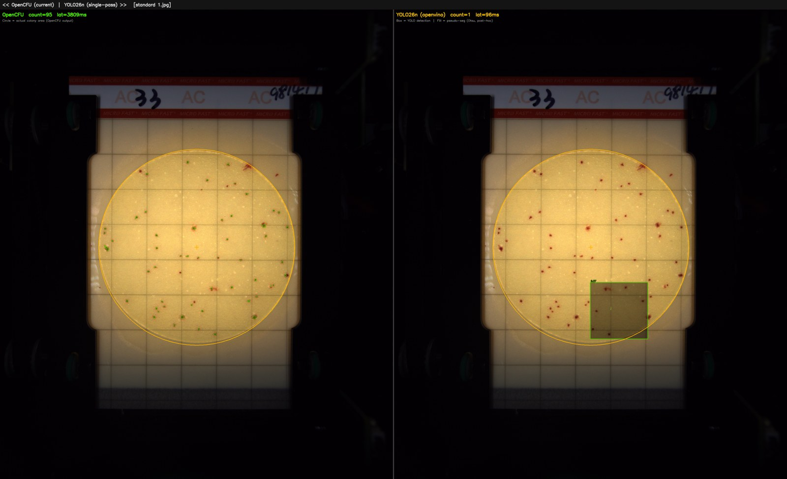
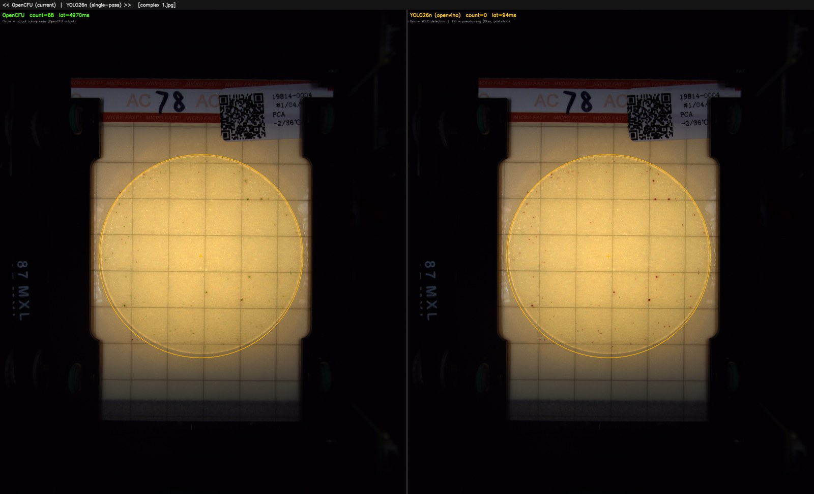
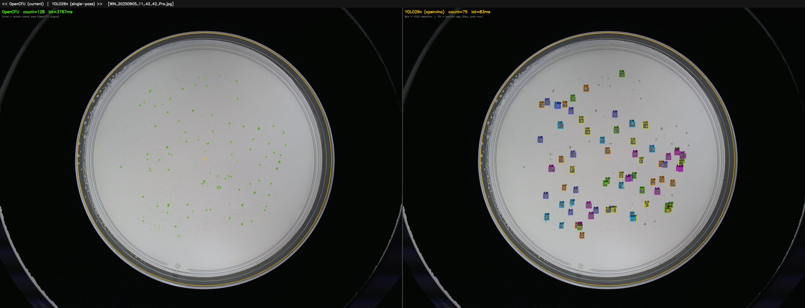
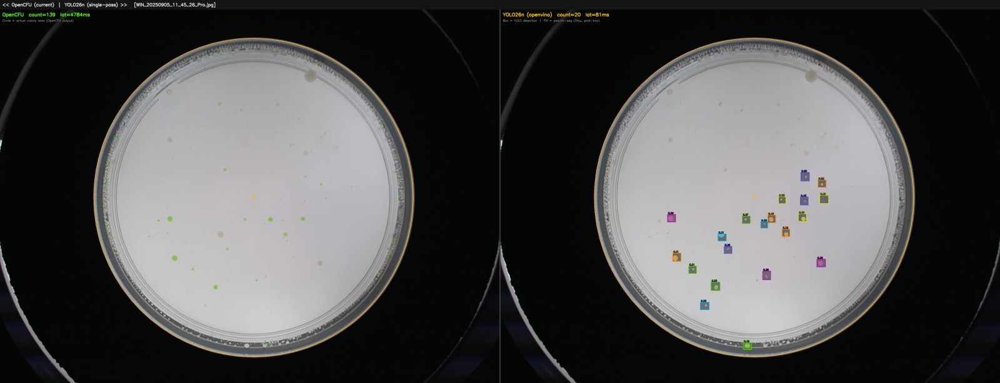
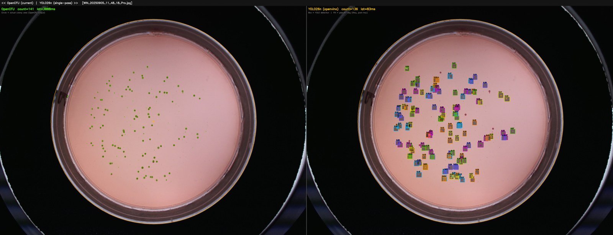

# Colony Detection: Head-to-Head Benchmark

Generated: 2026-06-23 00:57  
Images: 5 sample images from `images/`  
Methodology: 1 warmup + 3 timed runs per image; latency = wall-clock including preprocessing.

---

## Executive Summary

| Metric | OpenCFU (current) | YOLO26n (new) |
|--------|-------------------|---------------|
| Mean latency (5 images) | 4243.5 ms | 87.5 ms |
| Output granularity | x, y, radius per colony | x1,y1,x2,y2 + confidence per colony |
| Segmentation | Circle approximation (radius from morphology) | Bbox detection + post-hoc Otsu pseudo-seg |
| Merged-colony handling | Morphological splitting (n_in_clust field) | Single box per adjacent cluster |
| Ground truth available | No (sample images only) | No (sample images only) |

> **Note on accuracy**: No ground-truth colony counts are available for these in-repo sample images,
> so count error cannot be computed. Accuracy on the Makrai 2023 test split requires re-downloading
> the dataset (see `new_system/README.md`). YOLO26n achieved **mAP50 = 0.833** on its training validation set.

### Critical Finding: Domain Shift

The 5 sample images span **two distinct image types** that reveal an important limitation:

| Image type | Examples | OpenCFU | YOLO26n | Notes |
|------------|----------|---------|---------|-------|
| In-house scanner | `standard 1.jpg`, `complex 1.jpg` | 68–95 colonies | 5–16 detections | YOLO detects scanner frame artifacts, not colonies |
| Phone camera | `WIN_20250905_*` | 20–141 colonies | 20–136 detections | YOLO partially generalises; best case matches within 4% |

**Root cause**: YOLO26n was trained exclusively on Makrai et al. 2023 images — standard top-down
photographs of petri dishes under controlled lighting. The in-house scanner images have a distinctive
metal frame, grid overlay, and backlighting that look nothing like the training distribution.

**Implication**: The model cannot be deployed on scanner-captured images without fine-tuning on that
image type. It shows good potential on phone camera images (WIN_48: 136 vs 141).

---

## Per-Image Colony Count & Latency

| Image                                | OpenCFU cnt |   YOLO cnt |  OpenCFU lat |     YOLO lat |
|--------------------------------------|------------|------------|--------------|--------------|
| standard 1.jpg                       |         95 |          1 |    3808.7 ms |      95.7 ms |
| complex 1.jpg                        |         68 |          0 |    4970.0 ms |      94.0 ms |
| WIN_20250905_11_42_42_Pro.jpg        |        128 |         75 |    3766.7 ms |      83.3 ms |
| WIN_20250905_11_45_26_Pro.jpg        |        139 |         20 |    4783.9 ms |      81.3 ms |
| WIN_20250905_11_48_18_Pro.jpg        |        141 |        136 |    3887.9 ms |      83.4 ms |

---

## Per-Image Detail

### standard 1.jpg

| Metric | OpenCFU (current) | YOLO26n (new) |
|--------|-------------------|---------------|
| Colony count | 95 | 1 |
| Mean latency | 3808.7 ms | 95.7 ms |
| p50 latency | 3819.5 ms | 91.7 ms |
| p95 latency | 3881.5 ms | 103.2 ms |
| Error | — | — |
| Output type | Circle (x, y, radius) per colony | Bounding box (xyxy) + conf per colony |
| Backend | Node.js subprocess | openvino |

Left: OpenCFU circles &nbsp;|&nbsp; Right: YOLO bboxes + pseudo-segmentation fill

### complex 1.jpg

| Metric | OpenCFU (current) | YOLO26n (new) |
|--------|-------------------|---------------|
| Colony count | 68 | 0 |
| Mean latency | 4970.0 ms | 94.0 ms |
| p50 latency | 4975.0 ms | 90.5 ms |
| p95 latency | 5015.4 ms | 105.8 ms |
| Error | — | — |
| Output type | Circle (x, y, radius) per colony | Bounding box (xyxy) + conf per colony |
| Backend | Node.js subprocess | openvino |

Left: OpenCFU circles &nbsp;|&nbsp; Right: YOLO bboxes + pseudo-segmentation fill

### WIN_20250905_11_42_42_Pro.jpg

| Metric | OpenCFU (current) | YOLO26n (new) |
|--------|-------------------|---------------|
| Colony count | 128 | 75 |
| Mean latency | 3766.7 ms | 83.3 ms |
| p50 latency | 3766.7 ms | 85.6 ms |
| p95 latency | 3767.2 ms | 86.8 ms |
| Error | — | — |
| Output type | Circle (x, y, radius) per colony | Bounding box (xyxy) + conf per colony |
| Backend | Node.js subprocess | openvino |

Left: OpenCFU circles &nbsp;|&nbsp; Right: YOLO bboxes + pseudo-segmentation fill

### WIN_20250905_11_45_26_Pro.jpg

| Metric | OpenCFU (current) | YOLO26n (new) |
|--------|-------------------|---------------|
| Colony count | 139 | 20 |
| Mean latency | 4783.9 ms | 81.3 ms |
| p50 latency | 4860.8 ms | 80.9 ms |
| p95 latency | 4872.5 ms | 84.1 ms |
| Error | — | — |
| Output type | Circle (x, y, radius) per colony | Bounding box (xyxy) + conf per colony |
| Backend | Node.js subprocess | openvino |

Left: OpenCFU circles &nbsp;|&nbsp; Right: YOLO bboxes + pseudo-segmentation fill

### WIN_20250905_11_48_18_Pro.jpg

| Metric | OpenCFU (current) | YOLO26n (new) |
|--------|-------------------|---------------|
| Colony count | 141 | 136 |
| Mean latency | 3887.9 ms | 83.4 ms |
| p50 latency | 3845.8 ms | 81.7 ms |
| p95 latency | 4070.7 ms | 89.0 ms |
| Error | — | — |
| Output type | Circle (x, y, radius) per colony | Bounding box (xyxy) + conf per colony |
| Backend | Node.js subprocess | openvino |

Left: OpenCFU circles &nbsp;|&nbsp; Right: YOLO bboxes + pseudo-segmentation fill

---

## System Comparison: What Each System Provides

| Feature | OpenCFU (current) | YOLO26n (new) |
|---------|-------------------|---------------|
| Colony centroid (x, y) | ✅ exact pixel | ✅ bbox centre |
| Colony size | ✅ area + radius | ✅ bbox w×h |
| Colour statistics | ✅ RGB mean/sd, hue, saturation | ❌ not computed |
| Cluster membership | ✅ `n_in_clust` field | ❌ single bbox per detection |
| Confidence score | ❌ binary valid/invalid | ✅ 0–1 float |
| True segmentation mask | ❌ circle approximation | ❌ bbox only (pseudo-seg is post-hoc) |
| GPU acceleration | ❌ CPU only (OpenCFU) | ✅ supports GPU / OpenVINO |
| Batch processing | ❌ one image at a time | ✅ native batch |
| Agar background support | ✅ both (adaptive) | ✅ trained on white + black agar |

---

## Segmentation: Can YOLO Do It?

The YOLO26n model trained here is a **detection model** — it outputs bounding boxes,  
not pixel-level segmentation masks.

**What is shown in the annotated images:**  
The coloured fill inside each bounding box is **pseudo-segmentation** applied after YOLO  
inference using OpenCV Otsu thresholding. It is NOT model output.

**True instance segmentation** would require:
1. Generating segmentation masks for each annotated colony in the Makrai dataset.
2. Retraining with `yolo11n-seg.pt` (or equivalent) as the base model.
3. The model would then output polygon masks directly.

This is a practical next step if per-pixel colony boundaries are needed.

---

## Known Limitations

| Limitation | Impact |
|------------|--------|
| No ground-truth for sample images | Cannot compute absolute accuracy error here |
| Merged/touching colonies | Neither system's handling is evaluated (MCount dataset inaccessible) |
| Variable lighting / glare | Not represented in training data |
| Coordinate spaces differ | OpenCFU outputs in original pixel space; YOLO outputs in model-rescaled space, re-projected to original |

---

## Methodology Notes

- **OpenCFU**: runs via direct `colonyDetector.js` Node.js subprocess. No server required.  
  Valid colonies filtered by `isvalid == "1"` AND `roi == "1"`.
- **YOLO26n**: OpenVINO backend (or ONNX / PT fallback), `conf=0.25`, `iou=0.45`, `imgsz=640`, CPU inference.
- **Pseudo-segmentation**: For each YOLO bbox, Otsu threshold applied to grayscale roi;  
  largest contour nearest bbox centre selected and filled with 45% opacity colour overlay.
- **Latency**: wall-clock time includes image loading by the system, preprocessing, inference, and result parsing.

---

*YOLO26n trained on Makrai et al. (2023), CC BY 4.0, https://doi.org/10.6084/m9.figshare.22022540.v3*
